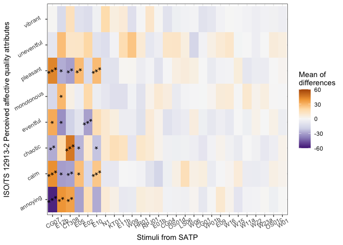

Replication code for: Assessment Of A Cost-Effective Headphone
Calibration Procedure For Soundscape Evaluations
================

## Data Preparation

The survey data was collected via a matlab GUI
(<https://github.com/kenowr/satp-gui>). The data from each participant
is stored in a single csv file. All participants’ data would be merged
into a single dataframe.

### Listening test data

``` r
#merge all csv files containing subjective data based on UCL calibration
allcsvnames.UCL <- list.files(path = "./UCL Result",
                        pattern = "*.csv", full.names = TRUE)
subj.UCL <- ldply(allcsvnames.UCL,read.csv,header=FALSE)

#merge all csv files containing subjective data based on NTU calibration
allcsvnames.NTU <- list.files(path = "./NTU Result",
                        pattern = "*.csv", full.names = TRUE)
subj.NTU <- ldply(allcsvnames.NTU,read.csv,header=FALSE)

#extract participant ID
participantID.UCL <- as.numeric(gsub(".*?([0-9]+).*", 
                                 "\\1", allcsvnames.UCL))
participantID.NTU <- as.numeric(gsub(".*?([0-9]+).*", 
                                 "\\1", allcsvnames.NTU))

noOfStimuli <- 27 #27 stimuli from SATP project
participantIDvec.UCL <- rep(1:length(participantID.UCL), each=noOfStimuli)
participantIDvec.NTU <- rep(1:length(participantID.NTU), each=noOfStimuli)

stimuli.Name <- read.csv2(file = "stimuliIDkey.csv",sep = ",")

#add participant ID col & stimuliName
subj.UCL<-cbind(participantIDvec.UCL,subj.UCL) %>% mutate(Calibration="UCL")
subj.NTU<-cbind(participantIDvec.NTU,subj.NTU) %>% mutate(Calibration="NTU") 

colnames(subj.UCL)<-c("participantID","stimuliID","pleasant", "chaotic",
                      "vibrant","uneventful","calm", "annoying",
                      "eventful","monotonous","check","duration","Calibration")
colnames(subj.NTU)<-c("participantID","stimuliID","pleasant", "chaotic",
                      "vibrant","uneventful","calm", "annoying",
                      "eventful","monotonous","check","duration","Calibration")

#remove outliers
subj.UCL<- subj.UCL %>%
  merge(.,stimuli.Name) %>%
  filter(participantID!=4) %>%
  filter(participantID!=16)

subj.NTU<- subj.NTU %>%
  merge(.,stimuli.Name) %>%
  filter(participantID!=1)

#Paired data
pairing.key<-read_delim("key_correspondence.txt",delim = "/",col_names = F) %>%
  `colnames<-`(c("NTU.ID","UCL.ID")) %>%
  mutate(UCL.ID=ifelse(UCL.ID=="No corresponding UCL",NA,UCL.ID)) %>% #remove unpaired
  filter(!NTU.ID==1) %>% #remove outlier
  merge(.,data.frame(UCL.ID=unique(subj.UCL$participantID)),all = TRUE)

#merge matched ID data from both NTU and UCL sets with corresponding key pairs

subj.comb<-rbind(subj.UCL %>% 
  filter(participantID %in% pairing.key$UCL.ID) %>%
  mutate(UCL.ID=participantID) %>%
  merge(.,pairing.key, by="UCL.ID"),subj.NTU %>% 
  filter(participantID %in% pairing.key$NTU.ID) %>%
  mutate(NTU.ID=participantID) %>%
  merge(.,pairing.key, by="NTU.ID"))  %>%
  select(!participantID)
```

## Optimal pooled t-test

``` r
paq<-c("eventful","vibrant","pleasant","calm",
       "uneventful","monotonous","annoying","chaotic")
n.stimuliID<-27

#initialise dataframe to store p.values of optt
optt.colnames<-c("stimuliID", "PAQ", "p.value","diff")
optt.pval.df<-data.frame(
  matrix(ncol=4,nrow=0, 
         dimnames=list(NULL, optt.colnames)))

#optimal pooled t-test for each stimuli and PAQ combination
for(st.ID in 1:n.stimuliID){
  for(paq.ID in paq){
    
    t<-subj.comb %>%
      filter(stimuliID==st.ID) %>%
      select(c("NTU.ID","UCL.ID",paq.ID,"Calibration")) %>%
      pivot_wider(names_from = Calibration,values_from = paq.ID)
    
    optt<-t.test.partial(as.data.frame(t[c("UCL","NTU")]))
    optt.pval.df<-rbind(optt.pval.df,
                      data.frame(st.ID,paq.ID,
                                 optt$p.value,optt$estimate,
                                 row.names = NULL) %>%
                        `colnames<-`(optt.colnames))
  }
}

optt.pval.df$stars <- cut(optt.pval.df$p.value, 
                     breaks=c(-Inf, 0.001, 0.01, 0.05, Inf), 
                     label=c("***", "**", "*", ""))
optt.pval.df<-merge(optt.pval.df,stimuli.Name)

options(repr.plot.width = 20, repr.plot.height =100)

#Plot heatmap of estimated mean of differences + signif stars
ggplot(optt.pval.df,aes(PAQ, UCLFilename)) + 
  geom_tile(aes(fill=diff)) +
  scale_fill_distiller(palette = "PuOr") +
  scale_y_discrete(expand = c(0, 0)) +
  geom_text(aes(label=stars), color="black", 
            size=5,vjust = -1) +
  theme_ipsum() 
```

 \##
Including Plots

You can also embed plots, for example:

<!-- -->

Note that the `echo = FALSE` parameter was added to the code chunk to
prevent printing of the R code that generated the plot.
